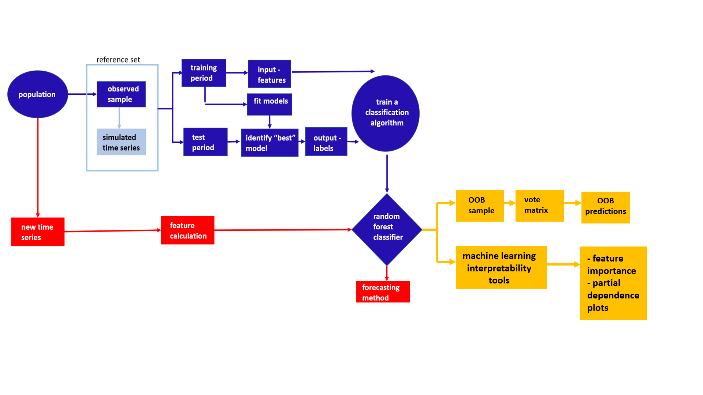

```{r setup, include=FALSE, cache=FALSE}
library(knitr)
knitr::opts_chunk$set(echo = FALSE, cache=TRUE, messages=FALSE, warning=FALSE, fig.path = 'figures/', dev=c('pdf'), fig.pos= "h", external = TRUE)
# Make sure you have the latest version of rmarkdown and bookdown
#devtools::install_github("rstudio/rmarkdown")
#devtools::install_github("rstudio/bookdown")
read_chunk("src/main.R") # common codes for all frequency categories
read_chunk("src/main_yearly.R")
read_chunk("src/main_quarterly.R")
read_chunk("src/main_monthly.R")
read_chunk("src/main_weekly.R")
read_chunk("src/main_daily.R")
read_chunk("src/main_hourly.R")
read_chunk("src/main_lime.R")
read_chunk("src/twowayPDPplots.R")
```

```{r loadPackages, cache=FALSE, warning=FALSE, message=FALSE}
```


# Introduction{#intro}

The field of time series forecasting has been evolving for several decades and has introduced a wide variety of models for forecasting. However, for a given time series the selection of an appropriate forecast model from many possibilities is not straightforward. This selection presents a challenge because each method performs best for some but not all tasks. The features of a time series are considered an important factor in identifying suitable forecasting models [@collopy1992rule; @meade2000evidence; @makridakis2000m3; @wang2009rule]. However, a comprehensive description of the relationship between the features and the performance of algorithms is rarely discussed. 

There have been several recent studies on the use of meta-learning approaches to automate forecast model selection based on features computed from the time series [@shah1997model; @prudencio2004meta; @lemke2010meta; @kuck2016meta]. A meta-learning approach provides systematic guidance on model selection based on knowledge acquired from historical data sets. The key idea is that forecast model selection is posed as a supervised learning task. Each time series in the metadata set is represented as a vector of features and labelled according to the best forecast model (for example, the model with the lowest mean absolute scaled error (MASE) over a test set). Then a meta-learner is trained to identify a suitable forecast model (usually a machine learning algorithm is used). In the era of big data, such an automated model selection process is necessary because the cost of invoking all possible forecast models is prohibitive. However, the existing literature suffers from limited answers to questions such as: How are features related to the property being modelled? How do features interact with each other to identify a suitable forecast model? Which features contribute most to the classification process? Addressing such questions can enhance the understanding of the relations between features and model selection outcomes. To the best of our knowledge, a very limited effort has been made to understand how the meta-learners are making their decisions and what is really happening inside these complex model structures. Providing transparency will result, building trust in the prediction results of the meta-learner.

Further, besides the goal of developing an automated forecast model selection framework, very few researchers have made an attempt to provide a description of the relationship between the features and the choice of different forecast models [@schnaars1984situational;  @wang2009rule;@lemke2010meta; @petropoulos2014horses are among some exceptions]. These studies are limited by the scale of problem instances used, the diversity of forecast models implemented, and the limited number of features considered to identify the relationship between features and forecast model performance. 

To fill these gaps, this paper makes a first step towards providing a comprehensive analysis of the relationship between time series features and forecast model selection using machine learning interpretability techniques. This paper builds on the method from our previous work @fforms,  in which we introduced the FFORMS (Feature-based FORecast Model Selection) framework. A random forest is used to model the relationship between features and best performing forecast model. A large collection of time series is used to train the meta-learner.

In this article, we make the following contributions:

1. We extend the FFORMS framework to handle weekly, daily and hourly series. We also extend the diversity of forecast models used as class labels. The contribution of this paper differs from previously published work related to meta-learning [@prudencio2004meta; @lemke2010meta; @kuck2016meta] in three ways: i) a more extensive collection of features is used (features to handle multiple seasonality in hourly and daily series), ii) there is a greater diversity of forecast models considered class labels, and iii) there is greater capability of handling high frequency data.
1. We analyse the application of the FFORMS framework to the M4 competition data. We generated point forecasts and prediction intervals for the M4 competition time series data, which is shown to yield accurate forecasts comparable to several benchmarks and other commonly used automated approaches of time series forecasting. Our approach achieved a high accuracy rate based on the individual forecast model selection rule. 
1. The main contribution of the paper is the exploration of what is happening under the hood of the FFORMS framework, leading to an understanding of the relationship between features of time series and the choice of forecast model selection using the FFORMS framework. We call it 'Peeking inside FFORMS'. We try to answer the following questions:
      i) **Which** features are the most important?
      ii) **Where** (overall classification or only within specific classes) are they important? 
      iii) **How** are they important? 
      iv) **When** and **how** are features linked to the prediction outcome?
      v) **When** and **how strongly** do features interact with other features?
      
The remainder of the paper is structured as follows. The  \autoref{fforms} outlines the extended FFORMS framework. \autoref{offline} through \autoref{peeking} explain the three main components of the extended FFORMS framework.  Results are discussed in \autoref{results1} and \autoref{results2}. \autoref{conclusions} concludes.

# Methodological framework{#fforms}

\autoref{fig:framework} shows the extended FFORMS framework with all additional components highlighted in yellow. There are three main components of this extended FFORMS framework. They are:

1. offline phase (blue): developing a meta-learner 
1. online phase (red): using the pre-trained meta-learner to identify the best forecast model. 
1. peeking inside FFORMS (yellow): gaining insights into what is happening under the hood of the FFORMS framework. 


```{r framework, fig.cap="Extended FFORMS (Feature-based FORecast-Model Selection) framework. The offline phase is shown in blue, the online phase in red and the peeking inside FFORMS is shown in yellow.", out.width='110%'}

```

# Offline phase{#offline}

We now explain the application of the FFORMS framework to the M4 competition data. We analyse yearly, quarterly, monthly, weekly, daily and hourly series separately because of their differences in frequencies and hence the appropriateness of different features and forecast models we considered as class labels. 

## Reference set

We call the collection of time series used for training the meta-learner the 'reference set'. The reference set consists of two sets of time series: i) the observed sample and ii) the simulated time series. 

### Observed sample

We use the time series from the M1, M3 and M4 competitions as the observed sample. Note that from the M4 competition a randomly selected subset of time series is used for the observed sample. The rest is used as a validation set to evaluate the performance of the meta-learner. Note that we did not use the test period of each series of the M4 competition in our observed sample or validation set because it was not available to the competitors during the running of the M4 competition.


### Simulated time series

As described in @fforms, we augment the reference set by adding multiple time series simulated using the training period of each series in the M4 competition. We use several automated algorithms to simulate multiple time series. The `ets()` and `auto.arima()` functions available in the forecast package in R [@forecast] are used to simulate yearly, quarterly and monthly data from exponential smoothing and ARIMA models. The `stlf()` function, also available in the forecast package, is used to simulate multiple time series based on a multiple seasonal decomposition approach. Using the above functions, we fit models to each time series in the M4 database and then simulate multiple time series from the selected models. In this experiment the length of the simulated time series is set to be equal to the length of the training
period specified in the M4 competition plus the length of the forecast horizon specified in the competition. For example, the series with id Y13190 contains a training period of length 835. The length of the simulated series generated from this series is equal to 841 (835 + 6). Before simulating time series from daily and hourly series, we convert the time series into multiple seasonal time series (msts) objects. For daily time series with a length of less than 366, the frequency is set to 7. Longer time series are converted to multiple seasonal time series objects with frequencies set to 7 and 365.25. For hourly series, we set the frequencies to 24 and 168 to handle multiple frequencies corresponding to time-of-day pattern and time-of-week pattern respectively. We should re-emphasise that all the observed time series and the simulated time series form the reference set used to build our meta-learner. Once we have created the reference set for random forest training, we split each time series in the reference set into training period and test period. 


## Input: features

The FFORMS framework operates on features calculated from the time series. For each time series in the reference set, features are calculated based on the training period of the time series. The description of the features calculated under each frequency category is shown in Table \ref{feature}. A comprehensive description of the features used in the experiment is given in @fforms.


\begin{table}[!htp]
\centering\footnotesize\tabcolsep=0.12cm
\caption{Time series features}
\label{feature}
\begin{tabular}{llp{8,8cm}cccc}
\toprule
\multicolumn{2}{c}{Feature} & Description & Y & Q/M & W & D/H\\
\midrule
1  & T              & length of time series                                                                   & \yes  & \yes & \yes & \yes\\
2  & trend          & strength of trend                                                                       & \yes  & \yes & \yes & \yes\\
3  & seasonality\_q    & strength of quarterly seasonality                                                    & -     & \yes & - & -\\
4  & seasonality\_m    & strength of monthly seasonality                                                      & -     & \yes & - & -\\
5  & seasonality\_w    & strength of weekly seasonality                                                       & -     & - & \yes & \yes \\
6  & seasonality\_d    & strength of daily seasonality                                                        & -     & - & - & \yes\\
7  & seasonality\_y    & strength of yearly seasonality                                                       & -     & - & - & \yes\\
8  & linearity      & linearity                                                                               & \yes  & \yes & \yes & \yes\\
9  & curvature      & curvature                                                                               & \yes  & \yes & \yes & \yes\\
10  & spikiness      & spikiness                                                                               & \yes  & \yes & \yes & \yes\\
11  & e\_acf1        & first ACF value of remainder series                                                     & \yes  & \yes & \yes & \yes\\
12  & stability      & stability                                                                               & \yes  & \yes & \yes & \yes\\
13  & lumpiness      & lumpiness                                                                               & \yes  & \yes & \yes & \yes\\
14 & entropy        & spectral entropy                                                                        & \yes  & \yes & \yes & \yes\\
15 & hurst          & Hurst exponent                                                                          & \yes  & \yes & \yes & \yes\\
16 & nonlinearity   & nonlinearity                                                                            & \yes\ & \yes & \yes & \yes\\
17 & alpha          & ETS(A,A,N) $\hat\alpha$                                                                 & \yes  & \yes & \yes & -\\
18 & beta           & ETS(A,A,N) $\hat\beta$                                                                  & \yes  & \yes & \yes & - \\
19 & hwalpha        & ETS(A,A,A) $\hat\alpha$                                                                 & -     & \yes & - & -\\
20 & hwbeta         & ETS(A,A,A) $\hat\beta$                                                                  & -     & \yes & - & - \\
21 & hwgamma        & ETS(A,A,A) $\hat\gamma$                                                                 & -     & \yes & - &-\\
22 & ur\_pp         & test statistic based on Phillips-Perron test                                            & \yes  & - & - & - \\
23 & ur\_kpss       & test statistic based on KPSS test                                                       & \yes  & - & - & - \\
24 & y\_acf1        & first ACF value of the original series                                                  & \yes  & \yes & \yes & \yes\\
25 & diff1y\_acf1   & first ACF value of the differenced series                                               & \yes  & \yes & \yes & \yes\\
26 & diff2y\_acf1   & first ACF value of the twice-differenced series                                         & \yes  & \yes & \yes & \yes\\
27 & y\_acf5        & sum of squares of first 5 ACF values of original series                                 & \yes  & \yes & \yes & \yes\\
28 & diff1y\_acf5   & sum of squares of first 5 ACF values of differenced series                              & \yes  & \yes & \yes & \yes\\
29 & diff2y\_acf5   & sum of squares of first 5 ACF values of twice-differenced series                        & \yes  & \yes & \yes & \yes \\
30 & sediff\_acf1 & ACF value at the first lag of seasonally-differenced series                               & -     & \yes & \yes & \yes\\
31 & sediff\_seacf1 & ACF value at the first seasonal lag of seasonally-differenced series                    & -     & \yes & \yes & \yes\\
32 & sediff\_acf5   & sum of squares of first 5 autocorrelation coefficients of seasonally-differenced series & -     & \yes & \yes & \yes\\
33 & seas\_pacf     & partial autocorrelation coefficient at first seasonal lag & -     & \yes & \yes & \yes\\
34 & lmres\_acf1    & first ACF value of residual series of linear trend model                                & \yes  & - & - & -\\
35 & y\_pacf5       & sum of squares of first 5 PACF values of original series                                & \yes  & \yes & \yes & \yes\\
36 & diff1y\_pacf5  & sum of squares of first 5 PACF values of differenced series                             & \yes  & \yes & \yes & \yes\\
37 & diff2y\_pacf5  & sum of squares of first 5 PACF values of twice-differenced series                       & \yes  & \yes & \yes & \yes\\
\bottomrule
\end{tabular}
\end{table}


## Output: class-labels

The description of class labels considered under each frequency is shown in Table \ref{classlabels}. Note that these added to @fforms. Most of the labels given in Table \ref{classlabels} are self-explanatory. In stlar, mstlets and mstlarima, first an STL decomposition or a multiple seasonal decomposition (for mstlarima and mstlets) is applied to the time series and then seasonal naive is used to forecast the seasonal component. Then AR, ETS and ARIMA models are used to forecast the seasonally adjusted data. We fit the corresponding models outlined in Table \ref{classlabels} to each series in the reference set. The models are estimated using the training period for each series, and forecasts are produced for the test periods. 

\begin{table}[!htp]
\centering\footnotesize\tabcolsep=0.12cm
\caption{Class labels}
\label{classlabels}
\begin{tabular}{llrrrr}
Class label & Description & Y & Q/M & W & D/H \\ \hline
wn & white noise process & \checkmark & \checkmark & \checkmark & \checkmark \\
ARMA & AR, MA, ARMA processes & \checkmark & \checkmark & \checkmark & -\\
ARIMA & ARIMA process & \checkmark & \checkmark & \checkmark & - \\
SARIMA & seasonal ARIMA & - & \checkmark & \checkmark & -\\
rwd & random walk with drift & \checkmark & \checkmark & \checkmark & \checkmark \\
rw & random walk & \checkmark & \checkmark & \checkmark & \checkmark  \\
theta & standard theta method & \checkmark & \checkmark & \checkmark & \checkmark \\
stlar &  & - & \checkmark & \checkmark & \checkmark \\
ETS\_NTNS & ETS without trend and seasonal components & \checkmark & \checkmark & - & - \\
ETS\_T & ETS with trend component and without seasonal component & \checkmark & \checkmark & - & -\\
ETS\_DT& ETS with damped trend component and without seasonal component  & \checkmark &  \checkmark & - & - \\
ETS\_TS & ETS with trend and seasonal component & - & \checkmark & - & - \\
ETS\_DTS & ETS with damped trend and seasonal component & - & \checkmark & - & -\\
ETS\_S & ETS with seasonal component and without trend component & -  & \checkmark & - & - \\
snaive & seasonal naive method & - & \checkmark & \checkmark & \checkmark \\
tbats & TBATS forecasting & - & \checkmark & \checkmark & \checkmark \\
nn & neural network time series forecasts & \checkmark & \checkmark & \checkmark & \checkmark \\
mstlets &  & - & - & \checkmark & \checkmark \\
mstlarima & & - & - & - & \checkmark \\\hline
\end{tabular}
\end{table}

According to the @M4compguide, in the M4 competition the forecast accuracy is evaluated based on the MASE and the symmetric mean absolute percentage error (sMAPE). Hence, to identify the best forecast model for each time series in the reference set, we combine MASE and the sMAPE calculated over the test set. More specifically, for each series, both forecast error measures, MASE and sMAPE, are calculated for each of the forecast models. Each of these is standardised by the median MASE and median sMAPE, calculated across the forecast models. The model with the lowest average value of the scaled MASE and scaled sMAPE is selected as the output class label. The last step of the offline phase of the framework  is to train a meta-learner. A random forest algorithm is used to train the meta-learner. 

# Online phase{#online}

The online phase of the algorithm involves generating point forecasts and 95% prediction intervals for the new series or the future values observed time series. We calculate point forecasts and prediction intervals over the test period of M4 competition data. First, the corresponding features are calculated based on the full length of the training period provided by the M4 competition. Second, point forecasts and 95% prediction intervals are calculated based on the predicted class labels. We should note that all negative forecasts are set to zero. According to the @M4compguide, the performance of prediction intervals are evaluated based on the mean scaled interval score (MSIS).

# Peeking inside FFORMS{#peeking}

The main objective of this paper is to explore the nature of the relationship between features and forecast model selection learned by the FFORMS framework. More specifically, it is to identify which of the features are important for model predictions and how different features and their interactions led to the different choices. First, we explore the global role of features in the choice of different forecast model selection. Global interpretability evaluates the behaviour of a model on an entire data set. The global perspective of model interpretation helps users to understand the overall modelled relationship between features and the FFORMS outcome. In the following subsections, we provide a description of tools we use to explore the global perspective of the FFORMS meta-learners.  


## Visualise patterns learned by the meta-learner

A useful by-product of random forest model is out-of-bag (OOB) observations. OOB observations are the observations not included in building a given tree. In general, each tree uses only around one third of observations in its construction. Further, each tree is grown based on different bootstrap samples; hence, each tree has a different set of OOB observations. We use a vote matrix calculated based on OOBs to visualise patterns learned by the random forest. The vote matrix ($N \times P$; $N$ is the total number of observations; $P$ is the number of classes) contains the proportion of times each observation was classified to each class based on OOB observations.


## Feature importance

@jiang2002 explain variable importance under three different views: i) causality (change in the value of $Y$ for an increase or decrease in the value of $X_i$), ii) contribution of $X_i$ based on out-of-sample prediction accuracy and iii) face value of $X_i$ on prediction function $g$. For example, in linear regression models estimated coefficients of each predictor can be considered a measure of variable importance. See @jiang2002 for comparable face value interpretation for machine learning models. In this paper we use the first two notions of variable importance. Partial dependency functions and individual conditional expectation curves are used to explore the 'causality' notion of variable importance, while mean decrease in Gini coefficient and permutation-based variable importance are used to capture the second notion of variable importance (feature contribution to the predictive accuracy) (@Zhao). We introduce each of these variable importance measures below.  

Let $\mathcal{P}=\{(\mathbf{x^{(i)}}, y^{(i)})\}_{i=1}^{N}$ be the
historical data set we use to train a classifier. Consider a
$d$-dimensional feature vector $\mathbf{X}=(X_1, X_2, ..., X_d)$ and a dependent
variable, the best forecasting method for each series $Y$. Let $\mathcal{G}$ be the unknown relationship between $\mathbf{X}$ and
$Y$. @Zhao call this 'law of nature'. Inside the FFORMS framework, the random forest algorithm tries to learn this relationship using
the historical data we provided. We denote the predicted function as
$g$.

### Mean decrease in Gini coefficient

Mean decrease in Gini coefficient is a measure of how each feature contributes to the homogeneity of the nodes and leaves in the resulting random forest proposed by @breiman2001random.


### Permutation-based variable importance measure

The permutation-based variable importance introduced by @breiman2001random measures the prediction
strength of each feature. This measure is calculated based on the  out-of-bag (OOB) observations. The calculation of variable importance is formalised as follows: Let $\bar{\mathcal{B}}^{(k)}$ be the OOB sample for a tree $k$, with $k\in \{1,...,ntree\}$, where $ntree$ is the number of trees in the random forest. Then the variable importance of variable $X_{j}$ in $k^{th}$ tree is:
  \[VI^{(k)}(X_{j})=\frac{\sum_{i\in \bar{\mathcal{B}}^{(k)}}I(\gamma_{i}=\gamma_{i,\pi_{j}}^{k})}{|\bar{\mathcal{B}}^{(k)}|}-\frac{\sum_{i\in \bar{\mathcal{B}}^{(k)}}I(\gamma_{i}=\gamma_{i}^{k})}{|\bar{\mathcal{B}}^{(k)}|},\]
where $\gamma_{i}^{k}$ denotes the predicted class for the $i^{th}$ observation before permuting the values of $X_{j}$ and $\gamma_{i, \pi_{j}}^{k}$ is the predicted class for the $i^{th}$ observation after permuting the values of $X_{j}$. The overall variable importance score is calculated as:
  \[VI(X_{j})=\frac{\sum_{t=1}^{ntree}VI^{(t)}(x_{j})}{ntree}.\]

Permutation-based variable importance measures provide a useful starting point for identifying the relative influence of features on the predicted outcome.  However, they provide little indication of the nature of the relationship between the features and model outcome. To gain further insights into the role of features inside the FFORMS framework we use the partial dependence plot (PDP) introduced by @friedman2008predictive. 


### Partial dependence plot (PDP) and Variable importance measure based on PDP

Partial dependence plots can be used to graphically examine how each feature is related to the model prediction while accounting for the average effect of other features in the model. Let $X_s$ be the subset of features we want to examine for partial dependencies and $X_c$ be the remaining set of features in $X$.  Then $g_s$, the partial dependence function on $X_s$ is defined as 
\[g_s(X_s)=E_{x_c}[g(x_s, X_c)]=\int{g(x_s, x_c)dP(x_c).}\] 
In practice, PDP can be estimated from a training data set as 
\[\bar{g_s}(x_s)=\frac{1}{n}\sum_{i=1}^{n}g(x_s, X_{iC}),\]
where $n$ is the number of observations in the training data set. A partial dependency curve can be created by plotting the pairs of $\{(x_s^k, \bar{g}_s(x_{sk}))\}_{k=1}^{m}$ defined on a grid of points $\{x_{s1}, x_{s2},\dots, x_{sm}\}$ based on $X_s$. The FFORMS framework has treated the forecast model selection problem as a classification problem. Hence, in this paper partial dependency functions display the probability of a certain class occurring given different values of the feature $X_s$.


@Greenwell2018 introduce a variable importance measure based on the partial dependency curves. The idea is to measure the 'flatness' of partial dependence curves for each feature. A feature with a PDP curve that is flat, relative to the other features, does not have much influence on the predicted value. The flatness of the curve is measured using the standard deviation of the values $\{\bar{g}_{s}(x_{sk})\}_{k=1}^{m}$.

### Individual conditional expectation (ICE) curves and variable importance measure based on ICE curves

While partial dependency curves are useful in understanding the estimated relationship between features and the predicted outcome in the presence of substantial interaction between features, they can be misleading.  @goldstein2015peeking propose individual conditional expectation (ICE) curves to address this issue. Instead of
averaging $g(x_s, X_{iC})$ over all observations in the training data, an ICE curve generates the individual response curves by plotting the pairs $\{(x_s^k, g(x_{sk}, X_{iC}))\}_{k=1}^{m}$ defined on grid of points $\{x_{s1}, x_{s2},\dots, x_{sm}\}$ based on $X_s$. In other words, the partial dependency curve is simply the average of all the ICE curves. 


This method is similar to the PDP-based variable importance scores above, but is based on measuring the 'flatness' of the individual conditional expectation curves. We calculate standard deviations of each ICE curve.  We then compute an ICE-based variable importance score, which is simply the average of all the standard deviations. A higher value indicates a higher degree of interactivity with other features. 

### Ranking of features based on feature importance measures

To identify important class-specific features we rank features in three different ways: i) based on permutation-based variable importance, ii) based on partial dependence functions and iii) based on ICE curves. We consider 25 features for yearly data. The feature that shows the highest importance is ranked 25, the second highest is ranked 24, and so on. Finally, for each feature a mean rank is calculated based on the rankings of the three measures. Similarly, the overall feature importance is evaluated based on the permutation-based variable importance measure and the Gini coefficient-based feature importance measure.

## Relationship between most important features and the choice of forecast model selection 

The partial-dependence curves, along with their confidence intervals, are used to visualise the relationship between top features and the choice of forecast model selection.

## Assessment of interaction effect

Friedman's H-statistic [@friedman2008predictive] is used to test the presence of interaction between all possible pairs of features. This statistic is computed based on the partial dependence functions. For two-way interaction between two specific variables $X_j$ and $X_k$, Friedman's H-statistic is defined as follows:

\[H_{jk}^2=\sum_{i=1}^{n}[\bar{g}_{s}(x_{ij}, x_{jk})-\bar{g}_{s}(x_{ij})-\bar{g}_{s}(x_{ik})]^2/\sum_{i=1}^{n}\bar{g}^2_{s}(x_{ij}, x_{jk}).\]

Friedman's H-statistic measures the fraction of variance of two-variable partial dependency, $\bar{g}_{s}(x_{ij}, x_{jk})$ not captured by the sum of the respective individual partial dependencies, $\bar{g}_{s}(x_{ij})+\bar{g}_{s}(x_{ik})$. In addition to Friedman's H-statistic, we use the PDP of two variables to visualise the interaction effects. Similarly, Friedman's H-statistic for testing whether a specific feature interacts with any other feature can be estimated by

\[H_{j}^2=\sum_{i=1}^{n}[{g}(\bm{x_{i}})-\bar{g}_{s}(x_{ij})-\bar{g}_{s}(x_{i/j})]^2/\sum_{i=1}^{n}g^2(\bm{x_{i}}).\]


Note that the, PD plots, ICE curves and PD- and ICE-associated measures and Friedman's H-statistic are computationally intensive to compute, especially when there are a large number of observations in the training set. Hence, in our experiments ICE- and PDP-based variable importance measures are computed based on the subset of randomly selected training examples.

## Local interpretable model-agnostic explanations (LIME)

Global interpretations help us to understand the entire modelled relationship.  Local interpretations help us to understand the predictions of the model for a single instance or a group of similar instances. In other words, this allows users to zoom into a particular instance or a subset and explore how different features affect the resulting prediction. We use the Local Interpretable Model-agnostic Explanations (LIME) approach introduced by @ribeiro2016should for explaining individual predictions. This approach relies on the assumption that 'every complex model is linear on a local scale'. It locally approximates the complex black box model with a simple interpretable model. @ribeiro2016should highlighted that globally important features may not be important in the local context, and vice versa. The algorithm steps can be summarized as follow: 

1. Select an observation of interest for which we need black box prediction explanations.
2. Create a permuted data set based on the selected observation. A permuted data set is created by making slight modifications to the features of selected observations.
3. Obtain similarity scores by calculating distance between permuted data and selected observation.
4. Obtain predicted outcomes for all permuted data using the black box model.
5. Select $q$ number of features best describing the black box model outcome. This can be accomplished by applying feature selection algorithms such as ridge regression and lasso regression.
6. Fit a simple linear model to the permuted data based on $q$ selected features, similarity scores in step 3 as weights and complex model prediction outcomes in step 4 as response variable.
7. Use the estimated coefficients of the simple linear model to explain how the local behaviour corresponds to the selected observation in step 1.

An alternative for explaining local behaviour of complex models is proposed by @lundberg2017unified. The approach is developed based on game theory, it is named 'Shapley values'.
\begin{table}[!h]
\centering\scriptsize\tabcolsep=0.12cm
\caption{The performance of FFORMS on the M4 competition data based on point forecasts (based on MASE) and prediction intervals (based on MSIS)}
\label{forecasts}
\begin{tabular}{l|rrrrrr}
\hline
\multicolumn{7}{c}{Point Forecasts (Mean Absolute Scaled Error (MASE))} \\\hline
 & Yearly & Quarterly & Monthly & Weekly & Daily & Hourly \\\hline
\bf{FFORMS} & \bf{3.17} &  \bf{1.20} &  \bf{0.98}&  \bf{2.31}& \bf{3.57} &  \bf{0.84}\\
auto.arima & 3.40 &1.17  &0.93  & 2.55 &  -& - \\
ets & 3.44 &  1.16& 0.95 &  -&-  &  -\\
theta & 3.37 &1.24  & 0.97 &2.64  & 3.33 & 1.59 \\
rwd & 3.07 & 1.33 & 1.18  & 2.68  & 3.25 & 11.45 \\
rw & 3.97 & 1.48 & 1.21  &2.78  & 3.27 & 11.60 \\
nn & 4.06 & 1.55 &  1.14 &4.04 & 3.90 & 1.09 \\
stlar & - & 2.02 &  1.33& 3.15 & 4.49 & 1.49 \\
snaive & - &  1.66& 1.26 &  2.78& 24.46 & 2.86 \\
tbats & - & 1.19 &  1.05& 2.49 & 3.27 &  1.30\\
wn & 13.42 &  6.50&  4.11&  49.91& 38.07 & 11.68 \\
mstlarima & - & - &  - & - & 3.84 &  1.12\\
mstlets & - &  - &  - &  - & 3.73 &  1.23\\
combination (mean) & 4.09 & 1.58 &  1.16&6.96  & 7.94 & 3.93 \\\hline
M4-1st & 2.98 & 1.12 &  0.88& 2.36 & 3.45 & 0.89\\
M4-2nd & 3.06 & 1.11 &  0.89& 2.11 & 3.34 & 0.81\\
M4-3rd & 3.13 & 1.12 &  0.91& 2.16 & 2.64 & 0.87\\\hline
\multicolumn{7}{c}{Prediction Intervals (Mean Scaled Interval Score (MSIS))} \\\hline
\bf{FFORMS} & \bf{39.79} &  \bf{11.24} &  \bf{9.82}&  \bf{20.84}& \bf{36.36} & \bf{8.07} \\
M4-1st & 23.89 & 8.55 &  7.20 & 22.03 & 26.28 & 7.92\\
M4-2nd & 27.47 & 9.38 &  8.65& 21.53 & 34.37 & 18.50\\
M4-3rd & \multicolumn{6}{c}{not submitted}\\
naive & 56.55 & 14.07 &  12.30 & 26.35 & 32.55 & 71.24\\\hline
\end{tabular}
\end{table}


# Evaluation based on the M4 competition data{#results1}

\autoref{forecasts} shows the performance of the FFORMS approach on the M4 competition data. The point forecasts and prediction intervals are evaluated based on the test period of each series. The point forecasts are evaluated based on the MASE computed for each forecast horizon, and then by averaging the MASE errors across all series corresponding to each frequency category. Similarly, MSIS is used to evaluate the prediction intervals. The results are compared against several benchmarks and the top three places of the M4 competition. The top-ranking methods of the M4 competition are based on some kind of combination approach. The first ranking method is based on a hybrid approach that produces forecasts based on both ETS and machine learning approaches. The second and third places are based on a combination of seven or eight different forecast models. The second and third approaches are time-consuming because forecasts from all candidate models must be computed. The results of the FFORMS approach are based on individual forecasts. According to the \autoref{forecasts}, we can see the FFORMS approach achieved comparable performance in a much more cost and time-effective way. Based on the FFORMS approach, we provided an entry to the M4 competition. After submission we found a bug in our implementation of hourly data, hence only the hourly data results are different from the published results of the M4 competition. The yearly, quarterly, monthly, weekly and daily result are same as the published results. This completes the evaluation of the FFORMS framework. The main question we have now is: 'Can we trust the FFORMS framework if we do not know how it works?' In the next section we present results showing what is happening inside the FFORMS framework. 

# What is happening under the hood of FFORMS?{#results2}

## Yearly series

The vote-matrix information for the yearly data is presented in \autoref{fig:yearlyoob}. \autoref{fig:yearlyoob} indicates three primary patterns: i) the distributions of correctly classified classes dominate, indicating a good classification of the meta-learner, and the associated outliers of the boxplots indicate some series are correctly classified with high probability; ii) irrespective of the class labels, the random walk with drift has a high chance of being selected for all series (the results of \autoref{results1} also show random walk with drift giving very high prediction accuracy with yearly series); and iii) the FFORMS framework successfully learned the similarities and dissimilarities between the classes itself.  For example, within ETS models with a trend component (ETS_T, 3rd panel), disparities between forecast models with trend components and forecast models without trend components (wn, ARMA, ETS_NTNS) are immediately visible. 


```{r yearlyoob, fig.height=10, fig.width=20, fig.cap="Visualisation of the vote matrix based on OOB sample for yearly random forest. Each panel shows the predicted class from the random forest. The X-axis denotes the proportion of times each time series was classified to each class. The colours of boxplots correspond to class label of the best forecast model identified based on MASE and sMAPE. On each row, distribution of correctly classified class dominates, indicating a good classification of the meta-learner.", fig.pos="h", dev='png'}
```


\autoref{fig:viyearly} shows the importance of each of the features we considered in the overall classification mechanism of the FFORMS, as well as within each class. The first panel gives the ranks of the overall variable importance of all features and the other panels show the class-specific feature rankings. The main point here is strength of trend, test statistic based on the Phillips-Perron unit root test, the first ACF value of the differenced series and linearity are the most important features across all categories.
In addition, the first ACF value of residual series of linear trend model (lmres_acf1) appears to be important within all classes.  In addition to linearity, the other features related to different types of trend (damped trend, measured by beta, and exponential trend, measured by curvature) are assigned a very high importance within ETS_T, ETS_DT and ETS_NTNS, which handles different versions of trend within the ETS family. Spikiness appears to be an important feature in the overall classification, and even though it does not appear to be among the top five features, spikiness has been assigned a relatively high importance within all categories. The reason for the high importance of spikiness within the overall classification is the high mean decrease in Gini coefficient. This suggests that it is the contribution of spikiness to the homogeneity of the nodes and leaves in the resulting random forest that makes it important, rather than its effect of causality. The length of time series (T) is assigned a very low importance within all categories. 


```{r viyearly, fig.height=10, fig.width=20, fig.cap="Feature importance plot for yearly series. Overall feature importance (top left plot) is evaluated based on two measures: i) permutation-based variable importance measure and ii) mean decrease in Gini coefficients. Class-specific feature importance is evaluated based on three measures: i) permutation-based variable importance, ii) PD-based variable importance measure, and iii) ICE-based variable importance measure. Longer bars indicate more important features. Top 5 overall features are highlighted in purple. Strength of trend appears to be the most important feature.", fig.pos="h"}
```


\autoref{fig:pdpyearlyurpp} to \autoref{fig:pdpyearlylinearity} show the partial dependency curves and associated confidence intervals of the top three features that are selected most in each class. In all three cases, within each class the displayed relationship is consistent with the theoretical expectations. For example, a high negative value of the Phillips-Perron test statistic indicates a stationarity of the series, while a positive value of the test statistic indicates nonstationarity of the series. According to \autoref{fig:pdpyearlyurpp}, we can see that the probability of selecting an ETS model with a trend component and ARIMA models increases steadily as ur_pp increases, while the opposite relationship could be observed for ARMA and WN. According to \autoref{fig:pdpyearlytrend}, we can see that the information about the strength of trend in the series is very important when selecting a forecast model. The probability of selecting an ETS model without trend components (ETS_NTNS), WN and ARMA decreases when the strength of trend is extremely high, while the opposite relationship can be observed for other classes. According to \autoref{fig:pdpyearlylinearity} random walk with drift and ARMA classes are highly sensitive to the value of linearity around 0. According to Friedman's H-statistic, diff1y_acf1 and lmres_acf1 show high levels of two-way interactivity. The associated two-way partial dependency plots are shown in \autoref{fig:intyearly}. The classes rw, rwd, ETS_NTNS, ARIMA and nn show interactivity. The plots suggest that the probability of selecting the corresponding model changes according to the changes in both diff1y_acf1 and lmres_acf1. Within the neural network class we can see that when lmres_acf1 arrives closer to 1, lmres_acf1 does not interact with diff1y_acf1. ETS_T shows low interactivity, irrespective of the value of diff1y_acf1 series, with a low value of lmres_acf1 leading to a high chance of selecting ETS_T model. Within ETS_T the colours of the bands are constant throughout the domain. However, for rw, rwd, ARIMA, theta and neural networks the strength of colour varies according to the levels of both diff1y_acf1 and lmres_acf1 indicating an interactivity between the two features.   The interactivity pattern within wn class is not visible at a 0-0.21 scale but it is visible within a 0-1 scale. The associated two-way partial dependency plot of wn series is shown in \autoref{fig:wntwopdcplots}. This suggests that two-way interactivity easily separates wn from the rest. 


```{r pdpyearlyurpp, fig.height=4, fig.width=15, fig.cap="Partial dependence plots for ur_pp. The shading shows the 95% confidence intervals. Y-axis denotes the probability of belonging to the corresponding class. All classes show a turning point in the relationship around zero.", fig.pos="h"}
```

```{r pdpyearlytrend, fig.height=4, fig.width=15, fig.cap="Partial dependence plots for trend. The shading shows the 95% confidence intervals. Y-axis denotes the probability of belonging to corresponding class. Probability of selecting ETS models without a trend component and stationary models (WN and ARMA) decreases for an extremely high value of trend.", fig.pos="h"}
```


```{r pdpyearlylinearity, fig.height=4, fig.width=15, fig.cap="Partial dependence plots for linearity. The shading shows the 95% confidence intervals. Y-axis denotes the probability of belonging to the corresponding class. Random walk with drift and ARMA classes are highly sensitive to the value of linearity around 0.", fig.pos="h", dev='png'}
```


```{r intyearly, fig.height=5, fig.width=10,  fig.pos="h", message=FALSE, warning=FALSE, fig.cap="Partial dependence of diff1y_acf1 and lmres_acf1 for yearly data. Dark regions show the high probability of belonging to the corresponding class shown in the plot title. Random walk with drift (rwd) and theta show a similar pattern of interactivity between diff1y_acf1 and lmres_acf1.", dev='png'}

```

## Quarterly series

```{r oobquarterly, fig.height=40, fig.width=40, dev='png',fig.pos="h", fig.cap="Visualisation of the vote matrix based on OOB sample for quarterly random forest. Each panel shows the predicted class from the random forest. The X-axis denotes the proportion of times each time series was classified to each class. The colours of boxplots correspond to class label of the best forecast model identified based on MASE and sMAPE. The disparities between dominating class and non-dominating classes are immediately apparent within ETS model classes.", dev='png'}
```

\autoref{fig:oobquarterly} shows the vote-matrix of the random forests for quarterly series based on OOB observations. The disparities between dominating class and non-dominating classes are immediately apparent within ETS_DT, ETS_T, ETS_DTS, ETS_TS, ETS_S and ARMA classes. Within each panel, the outliers associated with dominating distribution indicate some series are correctly classified with very high probability. Further, except for ETS_DTS, ETS_TS, ETS_S and SARIMA, all other series have a high chance of being classified into a random walk with drift (rwd) class. Within the theta and nn all distributions level at similar proportionalities as they both represent a general class of forecast models. Overall, the random forest successfully learned the similarities and dissimilarities between different forecast models. 

\autoref{fig:viquarterly} shows the feature importance plots for the quarterly series. The features seasonality_q, trend, diff1y_pacf5, linearity and spikiness are the most important features across all categories. Even though lumpiness does not appear as a top five feature within classes, it appears to be an important feature in the overall classification process and relatively high ranks are assigned within many classes. Except for, ETS_DT, ETS_DTS and ETS_TS, the features nonlinearity, hwalpha and hwbeta are assigned a very low importance within all other classes. 

\autoref{fig:pdpquarterlyseasonality} to \autoref{fig:pdpquarterlytrend} show the partial dependency curves and associated confidence intervals of the top three features that are selected most in each class. According to \autoref{fig:pdpquarterlyseasonality}, it is immediately apparent that the probability of selecting a seasonal forecast model increases as the strength of seasonality increases. According to \autoref{fig:pdpquarterlyseasonality} and \autoref{fig:pdpquarterlydiff1ypacf5}, probability of selecting SARIMA models drastically changes according to the change of seasonality_q, and diff1y_pacf5. The partial dependence plot of trend is very similar to the observed patterns in yearly data. 


According to Friedman's H-statistic (>0.5), curvature and e_acf1 is the most commonly appearing two-way interactivity. The associated partial dependency plots are shown in \autoref{fig:intquarterly}. The interactivity pattern of wn class is visible only according to the 0-1 scale, which suggests the two-way interactivity easily separates the wn class from the rest. Conversely, the interactivity pattern with ETS_NTNS, ETS_DT, ETS_T, ARMA, ARIMA is not visible within the 0-0.125 scale. The reason could be that these models do not have a parameter to handle seasonal components. Hence, the probability of selecting these models is relatively low compared with other models. Hence, the pattern of interactivity is not visible within the 0-0.125 scale.  According to \autoref{fig:intquarterly}, we can see that the pattern of interactivity does not completely change the individual relationship of the feature with the predicted outcome, but interactivity influences the probability of selecting the corresponding forecast model. For example, stlar models generally have a high change of being selected with series with high curvature value. However, this probability changes according to the values of e_acf1. Within ETS_S when curvature > 0, the two features show very low interactivity. 

```{r viquarterly, fig.height=12, fig.width=18, fig.cap="Feature importance plot for quarterly series. Overall feature importance (top left plot) is evaluated based on two measures: i) permutation-based variable importance measure and ii) mean decrease in Gini coefficients. Class-specific feature importance is evaluated based on three measures: i) permutation-based variable importance, ii) PD-based variable importance measure, and iii) ICE-based variable importance measure. Longer bars indicate more important features. Top 5 overall features are highlighted in purple. Strength of seasonality appears to be the most important feature."}

```


```{r pdpquarterlyseasonality, fig.height=6, fig.width=15, fig.cap="Partial dependence plots for strength of seasonality (seasonality_q). The shading shows the 95% confidence intervals. Y-axis denotes the probability of belonging to the corresponding class. Probability of selecting forecast models with seasonal components increases as seasonality increases.", fig.pos="h"}

```


```{r pdpquarterlydiff1ypacf5, fig.height=6, fig.width=15, fig.cap="Partial dependence plots for sum of squares of first 5 PACF values of differenced series (diff1y_pacf5). The shading shows the 95% confidence intervals. Y-axis denotes the probability of belonging to the corresponding class. Probability of selecting SARIMA models drastically increases as diff1y_pacf5 increases", fig.pos="h"}

```

```{r pdpquarterlytrend, fig.height=6, fig.width=15, fig.cap="Partial dependence plots for strength of trend (trend). The shading shows the 95% confidence intervals. Y-axis denotes the probability of belonging to the corresponding class. A very high value of strength of trend drastically influences the decision of selecting a forecast model.", fig.pos="h"}

```


```{r intquarterly, fig.height=10, fig.width=20,  fig.pos="h", message=FALSE, warning=FALSE, fig.cap="Partial dependence of curvature and e_acf1 for quarterly series. Dark regions show the high probability of belonging to the corresponding class shown in the plot title. ", dev='png'}

```

## Monthly series

\autoref{fig:oobmonthly} shows the vote-matrix information for monthly series.  Vote matrix information for monthly data depicted a similar pattern to quarterly data. For quarterly and monthly data, the same set of features and the class labels are used to train the model. Hence, this consistency between the results of the quarterly and the monthly series would provide evidence in support of the validity and trustability of the model. 


\autoref{fig:vimonthly} shows the feature importance plots for monthly data. For both quarterly and monthly data strength of seasonality, trend, linearity and spikiness are the most important features across all categories. In the case of yearly series, low variable importance is assigned to both stability and length of the series. However, within quarterly and monthly data, a high variable importance is assigned to length of the series and stability. In addition to the strength of seasonality, the models handling seasonal components (snaive, SARIMA and all ETS models with seasonal components) assigned a high importance to the additional features related to seasonality such as ACF, PACF-based features related to seasonal lag and seasonally differenced series. Further, as expected, features calculated based on parameters estimated from ETS(A, A, A) ranked as important for the choice of ETS with damped trend and seasonal component and ETS with trend and seasonal component. One notable difference between the quarterly series and the monthly series is that for monthly data, the length of the series is ranked among the top five, especially in random walk with drift, random walk, ETS with seasonal and trend components, ETS with a seasonal component, SARIMA and ARIMA classes. 

```{r oobmonthly, fig.height=40, fig.width=40, dev='png',fig.pos="h", fig.cap="Visualisation of the vote matrix based on OOB sample for monthly random forest. Each panel shows the predicted class from the random forest. The X-axis denotes the proportion of times each time series was classified to each class. The colours of boxplots correspond to class label of the best forecast model identified based on MASE and sMAPE. On each row, distribution of correctly classified class dominates, indicating a good classification of the meta-learner.", dev='png'}
```


The partial dependency curves of seasonality and trend of monthly data are very similar to the corresponding plots of quarterly data. Hence, these partial dependency curves are not repeated here. \autoref{fig:pdpmonthlylinearity} shows a partial dependency plot of linearity for monthly data. For non-seasonal forecast models the relationships are very similar to the corresponding observed curves in yearly data. Partial dependency curves of \autoref{fig:pdpmonthlyN} reveal highly parameterised models and models involving seasonal components such as (ETS_TS, ETS_DTS, ETS_S, SARIMA, tbats), which show an increasing relationship with length (T) up to some point. \autoref{fig:intmonthly} shows that partial dependency plots correspond to the interaction between hwalpha and sediff_seacf1. Friedman's H-statistic (0.78) shows a very high level of interactivity between the features hwalpha and sediff_seacf1 with neural network class. In addition to wn class, the interaction between the two features is more useful in separating out the rwd and stlar from the rest, as they show high probability of selecting the corresponding models throughout the region. The tbats class shows low interactivity between the two features. The main effect of hwalpha dominates within tbats because of the constant colour of the horizontal bands.  The classes snaive, rw, rwd, ETS_NTNS, stlar, theta and nn show varying degrees of colour strength bands, indicating that the probability of selecting the models changes according to the levels of both hwalpha and sediff_acf1.


```{r vimonthly, fig.height=12, fig.width=18,  fig.cap="Feature importance plot for monthly series. Overall feature importance (top left plot) is evaluated based on two measures: i) permutation-based variable importance measure and ii) mean decrease in Gini coefficients. Class-specific feature importance is evaluated based on three measures: i) permutation-based variable importance, ii) PD-based variable importance measure, and iii) ICE-based variable importance measure. Longer bars indicate more important features. Top 5 overall features are highlighted in purple. Strength of seasonality appears to be the most important feature."}

```


```{r pdpmonthlylinearity, fig.height=6, fig.width=15, fig.cap="Partial dependence plots for linearity. The shading shows the 95% confidence intervals. Y-axis denotes the probability of belonging to the corresponding class. All curves show a turning point in the relationship around zero.", fig.pos="h"}

```

```{r pdpmonthlyN, fig.height=6, fig.width=15, fig.cap="Partial dependence plots for length of time series (T). The shading shows the 95% confidence intervals. Y-axis denotes the probability of belonging to the corresponding class. Probability of selecting rw and rwd decreases as the length > 500.", fig.pos="h"}

```


```{r intmonthly, fig.height=10, fig.width=20,  fig.pos="h", message=FALSE, warning=FALSE, fig.cap="Partial dependence of hwalpha and sediff_seacf1 for monthly data. Dark regions show the high probability of belonging to the corresponding class shown in the plot title. ", dev='png'}

```

## Weekly series

```{r oobweekly, fig.height=10, fig.width=20, fig.cap="Visualisation of the vote matrix based on OOB sample for weekly random forest. Each panel shows the predicted class from the random forest. The X-axis denotes the proportion of times each time series was classified to each class. The colours of boxplots correspond to class label of the best forecast model identified based on MASE and sMAPE. The models rwd, tbats, nn have a high chance of being selected.", fig.pos="h", dev='png'}
```

\autoref{fig:oobweekly} shows the vote matrix information for weekly data. Unlike yearly, quarterly and monthly data, theta method has a low chance of being selected. The rwd, tbats models and nn have a high chance of being selected. ARMA class shows some unusual behaviour within some categories because of class imbalance ratio; it contains a smaller number of observations in the training set. 

According to the results of \autoref{fig:viweekly}, spikiness, linearity, trend, strength of seasonality, stability and lumpiness have been assigned a high importance. This is similar to the results of yearly, quarterly and monthly data. The length of series has been selected among the top five by mstlets, tbats, theta and nn models. The partial dependence plots for seasonality, trend and linearity are very similar to the patterns observed in quarterly and monthly data. Hence, we have not repeated the results. Instead, we have plotted the partial dependence plot for spikiness. According to \autoref{fig:weeklypdp}, the probability of selecting snaive, random walk, neural network and white noise increases as the spikiness increases, while other forecast model classes show the opposite. According to Friedman's H-statistic, curvature and linearity is the most commonly appearing two-way interactivity. The associated two-way partial dependency plots are shown in \autoref{fig:intweekly}. The interactivity pattern of ARMA is not visible between 0-0.15 scale as ARMA models have low chance of being selected with the weekly series. A unique pattern of interactivity could be observed within snaive, rw, SARIMA, stlar, mstlets, tbats, theta and nn. Within rw class we can see the main effect of linearity dominating; however, the strength of colour varies according to the level of curvature. 

```{r viweekly, fig.height=9, fig.width=15, fig.cap="Feature importance plot for weekly data. Permutation-based VI measure and mean decrease in Gini coefficient are used to evaluate overall feature importance. Class-specific feature importance is evaluated based on the three measures:i) permutation-based VI, ii) PD-based VI measure, and iii) ICE-based VI measure. Longer bars indicate more important features. Top 5 features are highlighted in purple.", fig.pos="h", fig.align="center"}
```


```{r weeklypdp, fig.height=5, fig.width=20, fig.cap="Partial dependence plots for spikiness. The shading shows the 95% confidence intervals. Y-axis denotes the probability of belonging to the corresponding class.", fig.pos="h"}
```


```{r intweekly, fig.height=10, fig.width=20,  fig.pos="h", message=FALSE, warning=FALSE, fig.cap="Partial dependence of linearity and curvature for weekly data. Dark regions show the high probability of belonging to the corresponding class shown in the plot title. ", dev='png'}

```


## Daily series

\autoref{fig:oobdaily} shows the vote matrix information for daily series. According to \autoref{fig:oobdaily}, the distributions corresponding to observations that have been correctly classified dominate the top for daily data.  However, within daily series there are few observations that have been incorrectly classified to tbats class with very high probabilities. In general, neural network models have a higher chance of being selected for daily time series. 


The variable importance graph for daily data is shown in \autoref{fig:vidaily}. The most important features for daily time series are, strength of seasonality corresponds to the weekly seasonality (measured by seasonal_w), stability, trend, lumpiness and linearity. Further, the length of the series is important in determining random walk, random walk with drift, mstlarima, mstlets, stlar, theta and nn classes.

In \autoref{fig:dailypdpstability} we can see that the probability of selecting white noise models increases as stability increases. According to the partial dependency curves of length (T),
\autoref{fig:dailypdpN}, shorter series tend to select random walk with drift models while the probability of selecting snaive, mstlarima and mstlets models increases as the length of the series increases. Neural network models show a non-monotonic relationship with the length of the series (T). For daily time series, stability and strength of seasonality (seasonality_w) shows high levels of two-way interactivity within many classes (\autoref{fig:intdaily}). The classes theta and nn show high levels of interactivity between seasonal_w and stability. Within theta and nn the separation of quadrants is easily seen. For example, with low values of seasonal_w and low stability, nn models have a high chance of being selected, while with high values of seasonal_w and  stability, nn models have a low chance of being selected. The opposite relation can be observed within rw, mstlarima, tbats and theta classes.

```{r oobdaily, fig.height=10, fig.width=20, fig.cap="Visualisation of the vote matrix based on OOB sample for daily random forest. Each panel shows the predicted class from the random forest. The X-axis denotes the proportion of times each time series was classified to each class. The colours of boxplots correspond to class label of the best forecast model identified based on MASE and sMAPE. The models rwd, tbats, nn have a high chance of getting selected.", fig.pos="h", dev='png'}
```

\clearpage

```{r vidaily, fig.height=11, fig.width=23, fig.cap="Feature importance plot for daily data. Permutation-based VI measure and mean decrease in Gini coefficients are used to evaluate overall feature importance. Class-specific feature importance is evaluated based on the three measures: i) permutation-based VI, ii) PD-based VI measure, and iii) ICE-based VI measure. Longer bars indicate more important features. Top 5 features are highlighted in purple.", fig.pos="h", fig.align="center"}
```
 

```{r dailypdpstability, fig.height=5, fig.width=20, fig.cap="Partial dependence plots for stability. The shading shows the 95% confidence intervals. Y-axis denotes the probability of belonging to the corresponding class.", fig.pos="h"}
```

```{r dailypdpN, fig.height=5, fig.width=20, fig.cap="Partial dependence plots for length. The shading shows the 95% confidence intervals. Y-axis denotes the probability of belonging to the corresponding class.", fig.pos="h"}
```


```{r intdaily, fig.height=10, fig.width=20,  fig.pos="h", message=FALSE, warning=FALSE, fig.cap="Partial dependence of seasonal_w and stability for daily data. Dark regions show the high probability of belonging to the corresponding class shown in the plot title. Random walk (rw) and tbats class show opposite patterns of interactivity between seasonal_w and stability.", dev='png'}

```


## Hourly series

\autoref{fig:oobhourly} shows the vote matrix information for hourly data. Overall, for hourly series random walk with drift, tbats and neural network models have a high chance of being selected. Further, it is important to note that within nn all distributions are located away from series, which indicates all hourly series have been assigned a non-zero probability of being selected to neural network class. 

The variable importance graph for hourly data is shown in \autoref{fig:vihourly}. According to \autoref{fig:vihourly}, the strength of daily seasonality (measured by seasonal_d) appears to be more important than the strength of weekly seasonality (measured by seasonal_w). However, the strength of weekly seasonality also seems to be one of the most important features for classes snaive, random walk, mstlarima, and tbats. Further, entropy, linearity, sum of squares of first five coefficients of PACF, curvature, trend, spikiness and stability were found to be the most important features in determining the best forecasting method for hourly time series. Only the snaive category ranked T among the top five for hourly time series. 

The partial dependency plots of the strength of seasonalities are shown in \autoref{fig:seasonalityhourly}. According to \autoref{fig:seasonalityhourly}, the probability of selecting random walk, random walk with drift, theta and white noise process decreases with a higher value of strength of daily seasonality. On the other hand, the probability of the selecting random walk model increases as the strength of weekly seasonality increases. The partial dependency plots of entropy are shown in \autoref{fig:entropyhourly}. The entropy measures forecastability of time series. We can see that the probability of selecting random walk with drift and tbats decreases as the entropy increases. This is consistent with our theoretical expectations. In other words, if the series has a clear trend or a clear trigonometric pattern, the forecastability of the time series is high and the entropy is low. For highly trended series the random walk with drift model is suitable, while for a series with trigonometric pattern the tbats model is suitable.

Friedman's H-Statistic shows high levels of interactivity between sediff_seacf1 and linearity across all classes. The associated two-way partial dependency plot is shown in \autoref{fig:htwopdp}. According to the \autoref{fig:htwopdp}, we can see there is a unique pattern of interactivity existing within each class. Within rw, rwd and mstlarima we can see a separation between the lower half and the upper half due to the effect of sediff_seacf1. However, the colours of the bands are not uniform across the bands, which indicates that the probability of selecting the models changes according to the levels of linearity. The two-way partial dependency plots show rwd has a high chance of being selected with series with low sediff_seacf1; this is due to the over differencing of the series. 

```{r oobhourly, fig.height=10, fig.width=20, fig.cap="Visualisation of the vote matrix based on OOB sample for hourly random forest. Each panel shows the predicted class from the random forest. The X-axis denotes the proportion of times each time series was classified to each class. The colours of boxplots correspond to class label of the best forecast model identified based on MASE and sMAPE. The models rwd, tbats, nn have a high chance of being selected.", fig.pos="h", dev='png'}
```


```{r vihourly, fig.height=11, fig.width=23, fig.cap="Feature importance plot hourly series. Permutation-based VI measure and mean decrease in Gini coefficients are used to evaluate overall feature importance. Class-specific feature importance is evaluated based on the three measures: i) permutation-based VI, ii) PD-based VI measure, and iii) ICE-based VI measure. Longer bars indicate more important features. Top 5 features are highlighted in purple.", fig.pos="h"}
```


```{r seasonalityhourly, fig.height=5, fig.width=20, fig.cap="Partial dependence plots for strength of seasonality. The shading shows the 95% confidence intervals. Y-axis denotes the probability of belonging to the corresponding class.", fig.pos="h"}
```

```{r entropyhourly, fig.height=5, fig.width=20, fig.cap="Partial dependence plots for entropy. The shading shows the 95% confidence intervals. Y-axis denotes the probability of belonging to the corresponding class.", fig.pos="h"}
```


```{r htwopdp, fig.height=10, fig.width=20,  fig.pos="h", message=FALSE, warning=FALSE, fig.cap="Partial dependence of sediff_seacf1 and linearity for hourly data. Dark regions show the high probability of belonging to the corresponding class shown in the plot title. Random walk and random walk with drift class show opposite pattern of interactivity between sediff_seacf1 and linearity.", dev='png'}

```


## Local interpretable model-agnostic explanations

We now illustrate how the LIME approach can be used to zoom into local regions of the data to identify which features contribute most to the classification of a specific instance. For the illustration we select four different time series classified with high probability. \autoref{fig:quarterlylime2} shows the feature contribution for the instances highlighted on the PCA-space of quarterly series. We can see how the strength of seasonality influences the FFORMS framework to select different types of seasonal  forecast models. For example, the SARIMA model is selected when the seasonality varies between 0.579 and 0.787 (case 1), the ETS-seasonal model is selected when the strength of seasonality is greater than 0.787 (case 4), random walk with drift when the seasonality is lower than 0.579 (case 2) and for the highly trended and seasonal series (strength of seasonality > 0.895) the ETS model with a trend and seasonal component is selected (case 3). Further, high value of diff1y_acf5 supports the selection of SARIMA for case 1; moderate value of diff1y_acf5 supports the selection of ETS-seasonal for case 4. Similarly, we can explore the reasons for other instances in all frequency categories. From the LIME approach we can gain insight into the local neighbourhood characteristics that lead to the choice of a particular neighbourhood over alternative destinations.


```{r quarterlylime, fig.height=8, fig.width=20, fig.cap="", fig.pos="h", fig.align="center",  dev='png'}
```

```{r quarterlylime2, fig.height=8, fig.width=15, fig.cap="Panel A: Distribution of quarterly time series in the PCA space. Panel B: Time series corresponds to the highlighted points in the PCA space. Panel C: Local interpretable model-agnostic explanations for four selected quarterly time series. Features denoted with blue colour are supporting features for an outcome label and length of the bar is proportional to the weight of a feature.", fig.pos="h", fig.align="center", cache=FALSE, dev='pdf'}
```


# Discussion and Conclusions{#conclusions}

Features of time series are useful in identifying suitable models for forecasting. This paper explores the role of features in forecast model selection under the hood of the FFORMS framework. First, we evaluate the FFORMS prediction performance using the M4 competition data. Then we explore the dissimilarities and similarities of forecast models (class labels) learned by the FFORMS framework based on the vote-matrix information of the random forest. Next, we explore **which** features are the most important for the choice of the FFORMS framework, and **where** they are most important; for the overall classification process or within a specific class of forecast models or a set of multiple classes of forecast models. Partial dependency plots are then used to visualise **when** and **how** these features link with the prediction outcome of the FFORMS framework. Finally, we explore **when** and **how strongly** features interact with other features using Friedman's H-Statistic. 

Features such as the strength of trend and strength of seasonality rank top within each class across all frequency categories. In addition, linearity, curvature and spikiness also rank among the top five within most of the classes. Within most of the classes at least one feature related to autocorrelation and partial autocorrelation coefficients ranks among the top five. This confirms that the information regarding the correlation structure of the time series is essential for the choice of model selection. The length of time series also appeared to be important in selecting simple forecast models such as snaive, naive and random walk with drift. Partial dependency plots of length show that short time series tend to select simple forecast models such as snaive, naive and random walk with drift while more parametrised forecast models such as SARIMA, ETS with trend and seasonal component, the neural network approach and forecast models handling multiple seasonal components are often selected with lengthy series. For all features, the displayed relationships of partial dependency plots are consistent with the domain knowledge expectations. This is an important aspect in encouraging people to trust and use the proposed framework effectively. However, several features are used to build the framework with comparable contributions, and thus all individual contributions are small. The observed two-way interactions do not completely change the individual relationship of features with the predicted outcome, but they do change the probability of selecting the models. Further, the LIME  approach is used to explore the reasons behind each individual prediction. Exploration of other local interpretability methods is a direction for future research. This is useful for understanding the reasons behind series being classified with very high probability or very low probability. It also helps to increase trust in the framework because if people understand the reasons behind the results, they can use their prior knowledge about the application domain to decide whether to accept (trust) or reject the prediction outcome. The results of this help to refine the picture of the relationship between features and the choice of forecast model, which is particularly valuable for ongoing research in the field of feature-based time series analysis.

Exploring of the conditions learned by the FFORMS framework also supports practitioners to make a good educated guess about suitable forecast models for a given problem. Further, the results of this study are useful in identifying new ways to improve forecasting accuracy by capturing different features of time series.

# Appendix: Interaction effects {-}

\autoref{fig:friedmany}-\autoref{fig:friedmanh} show how strongly each feature interacts with any other feature in the forest for yearly, quarterly, monthly, weekly, daily and hourly series. On each panel the top five interacting features are highlighted in purple.

According to \autoref{fig:viyearly}, which shows the variable importance plots for yearly data, the feature linearity is assigned a very high variable importance within rwd and ARMA, but according to \autoref{fig:friedmany}, linearity shows very low interactivity within rw and rwd. This means that linearity is more important on its own than with its interaction effect. \autoref{fig:pdpyearlylinearity} further confirms this as the partial dependency curves corresponding to rwd and ARMA drastically change as linearity varies. According to \autoref{fig:friedmanq}, quarterly data strength of seasonality shows relatively low interactivity, indicating the importance of the main effect of seasonality for the classification process. Further, the length of the time series shows a high level of interactivity within the random walk class. According to \autoref{fig:friedmanm} and \autoref{fig:friedmanw}, in the process of classifying monthly and weekly series the number of features showing a high level (>0.5) of interactivity within classes is relatively low. This reflects the importance of the individual effect of features when selecting forecast models for monthly and weekly series. Weekly data FFORMS frameworks show a high level of interactivity of features within ARMA. This is due to the class imbalance. Weekly series reference data sets contained a very small number of ARMA labelled series. Hence, features interact highly to separate ARMA from the rest. Similar to the results of weekly and monthly data, according to \autoref{fig:friedmand}, the number of features that show high level of interactivity (> 0.7) with other features is relatively low. 


```{r friedmany, fig.height=10, fig.width=20, fig.cap="The interaction strength (Friedman's H-Statistic) for each feature with any other feature for yearly forest. The Hurst exponent within ETS_DT has the highest interaction effect.", fig.pos="h", dev='pdf', cache=FALSE}
```


```{r friedmanq, fig.height=12, fig.width=18, fig.cap="The interaction strength (Friedman's H-Statistic) for each feature with any other feature for quarterly forest. Top 5 interacting features are highlighted in purple. Strength of seasonality shows an extremely low interactivity within SARIMA, ETS_DT and ETS_DTS.", cache=FALSE}

```


```{r friedmanm, fig.height=12, fig.width=18, fig.cap="The interaction strength (Friedman's H-Statistic) for each feature with any other feature for monthly forest. Top 5 interacting features are highlighted in purple. Curvature shows highest level of interactivity within nn", cache=FALSE}

```


```{r friedmanw, fig.height=8, fig.width=15, fig.cap="The interaction strength (Friedman's H-Statistic) for each feature with any other feature for weekly forest. Overall, the interaction effects between the features are very weak.", fig.pos="h", fig.align="center", cache=FALSE}
```


```{r friedmand, fig.height=12, fig.width=23, fig.cap="The interaction strength (Friedman's H-Statistic) for each feature with any other feature for daily forest. Strength of annual seasonality shows highest level of interactivity within white noise class.", fig.pos="h", fig.align="center", cache=FALSE}
```


```{r friedmanh, fig.height=12, fig.width=23, fig.cap="The interaction strength (Friedman's H-Statistic) for each feature with any other feature for hourly forest. Linearity shows high level of interactivity within random walk with drift.", fig.pos="h", fig.align="center", cache=FALSE}
```

\clearpage

```{r wntwopdcplots, fig.height=4, fig.width=8, fig.cap="Partial dependency plots for wn class", fig.pos="h", dev='pdf', cache=FALSE}
```


# References

